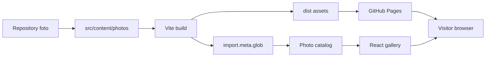
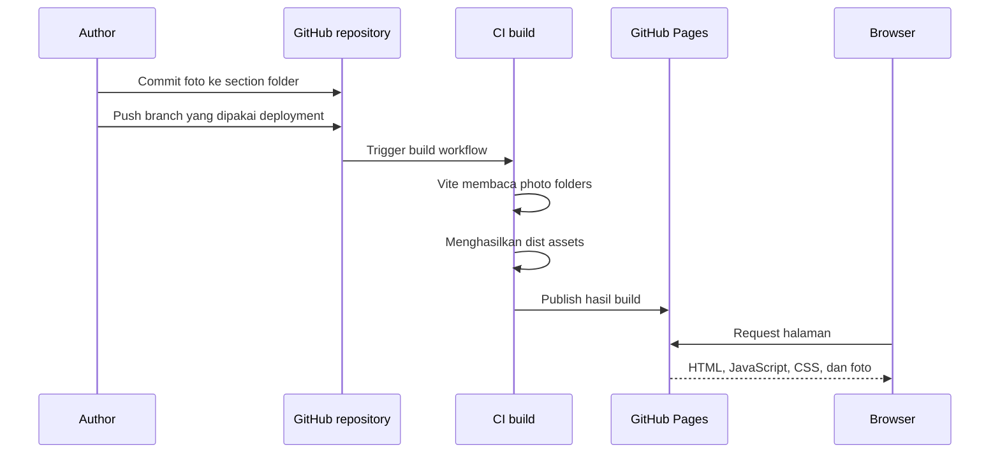

# Arsitektur galeri foto berbasis folder untuk GitHub Pages

**Content type:** Reference

**Goal:** Menjelaskan arsitektur galeri foto statis yang mengambil foto dari subfolder repository, merendernya saat build Vite, dan menerbitkannya melalui GitHub Pages.

## Ringkasan

Aplikasi ini tidak memakai database, backend, atau GitHub API untuk upload runtime. Repository menjadi source of truth untuk foto dan section. Setiap subfolder di `src/content/photos/` menjadi satu section di aplikasi.

```text
Foto ditambahkan ke repository
  -> Git commit dan push
     -> Vite membaca folder saat build
        -> GitHub Pages menerbitkan hasil build
           -> Galeri menampilkan foto pada section yang sesuai
```

Foto tidak muncul pada halaman secara langsung setelah upload. Foto muncul setelah commit, build, deployment, dan refresh cache selesai.

## Keputusan arsitektur

### Keputusan utama

- Gunakan React dan Vite yang sudah ada.
- Simpan konten foto di `src/content/photos/`.
- Gunakan `import.meta.glob` untuk discovery asset saat build.
- Jadikan nama subfolder sebagai identitas section.
- Render foto sebagai static asset yang diproses Vite.
- Deploy hasil build melalui GitHub Pages.
- Jangan menambahkan database untuk MVP.
- Jangan menambahkan upload runtime ke aplikasi.
- Jangan menggunakan GitHub API dari browser untuk menyimpan foto.

### Alasan

GitHub Pages adalah static site hosting. GitHub Pages menyajikan HTML, CSS, dan JavaScript dari repository, tetapi tidak menyediakan filesystem write API untuk aplikasi yang sedang berjalan.

Discovery folder harus dilakukan ketika Vite membangun aplikasi. Browser hanya menerima hasil akhirnya, bukan akses ke struktur folder repository.

## Konteks codebase

Repository saat ini menggunakan:

| Area | Kondisi |
|---|---|
| Bahasa | JavaScript dan JSX |
| UI | React 19 |
| Build | Vite 5 dengan React SWC |
| Style | Sass |
| Entry point | `src/main.jsx` |
| Root aplikasi | `src/App.jsx` |
| Routing | Window manager, bukan router |
| Persistence | `localStorage` pada feature tertentu |
| Backend | Tidak ditemukan |
| Database | Tidak ditemukan |
| Deployment base | `/macweb.dev/` pada production build |

File `vite.config.js` sudah memiliki konfigurasi berikut:

```js
base: isProd ? "/macweb.dev/" : "/",
```

Karena itu, asset foto harus memakai URL hasil import Vite. Jangan membangun URL production secara manual dengan awalan `/`.

## Batas integrasi

Feature foto harus berdiri sebagai feature baru:

```text
src/
├── content/
│   └── photos/
├── features/
│   └── photos/
└── styles/
    └── components/
        └── Photos/
```

Feature ini tidak perlu mengubah:

- `src/core/providers/WindowManagerProvider.jsx`
- `src/utils/renderAppContent.jsx`
- `src/core/constants/apps.jsx`
- `src/main.jsx`
- `vite.config.js`
- `package.json`

Jika galeri harus dibuka sebagai aplikasi dalam simulator desktop, integrasi window dapat ditambahkan sebagai pekerjaan terpisah. Galeri tetap harus memiliki feature boundary sendiri dan tidak boleh mencampur state foto dengan state window.

## Struktur konten

```text
src/content/photos/
├── favorites/
│   ├── beach.jpg
│   └── sunset.webp
├── travel/
│   ├── bali.jpg
│   └── japan.png
└── portraits/
    └── profile.jpg
```

Aturan:

- Satu subfolder menjadi satu section.
- File gambar langsung di dalam subfolder menjadi item section.
- Folder bersarang di bawah section belum didukung pada MVP.
- Folder kosong tidak menghasilkan section.
- Nama file menjadi fallback caption.
- ID foto berasal dari path relatif, bukan posisi array.
- Ekstensi yang didukung: `.jpg`, `.jpeg`, `.png`, `.webp`, dan `.gif`.
- Nama file sebaiknya menggunakan karakter ASCII, angka, underscore, atau hyphen.

## Discovery asset saat build

Vite dapat mengubah seluruh asset yang cocok dengan pola glob menjadi URL hasil build. URL tersebut akan mengikuti base path dan nama file asset production.

Konsep discovery:

```js
const photoModules = import.meta.glob(
  "/src/content/photos/**/*.{jpg,jpeg,png,webp,gif}",
  {
    eager: true,
    query: "?url",
    import: "default",
  },
);
```

Feature catalog kemudian melakukan tiga langkah:

1. Mengubah setiap entry menjadi `{ id, sectionId, sectionLabel, name, url }`.
2. Mengambil segment pertama setelah `src/content/photos/` sebagai `sectionId`.
3. Mengelompokkan item berdasarkan `sectionId`.

Contoh hasil internal:

```text
{
  id: "travel/japan.png",
  sectionId: "travel",
  sectionLabel: "Travel",
  name: "japan.png",
  url: "/macweb.dev/assets/japan-abc123.png"
}
```

`id` harus memakai path relatif karena dua section dapat memiliki nama file yang sama.

## Mengapa bukan directory listing runtime

Folder `public/` hanya menyalin file ke output build. Browser tidak memperoleh daftar isi folder dari GitHub Pages, sehingga request ke `/photos/` tidak menjamin adanya directory index.

Karena itu, pilihan berikut memiliki perilaku berbeda:

| Lokasi | Auto-discovery | URL | Rekomendasi |
|---|---|---|---|
| `src/content/photos/` | Ya, melalui Vite glob | Dihash dan base-aware | Pilihan utama |
| `public/photos/` | Tidak | Nama file tetap | Hanya untuk file dengan manifest |
| GitHub API runtime | Bisa | Membutuhkan API dan auth | Tidak untuk MVP |

## Diagram arsitektur



## Alur upload dan deployment



## Mekanisme upload yang didukung

### Upload melalui GitHub web

Pengguna dengan akses repository dapat membuka folder section, memilih **Upload files**, lalu melakukan commit.

Kelebihan:

- Tidak perlu membuat upload UI.
- Tidak perlu menyimpan token di browser.
- Semua perubahan masuk ke Git history.
- Deployment dapat diaudit melalui commit.


Workflow lokal:

```text
Salin foto ke src/content/photos/<section>/
  -> git add
     -> git commit
        -> git push
```

Cara ini cocok jika satu admin mengelola seluruh galeri.

### Upload dari halaman aplikasi

Model ini tidak termasuk MVP. Upload dari browser memerlukan GitHub API atau backend.

Risiko utamanya:

- Personal access token dapat bocor.
- Token frontend dapat dibaca pengunjung.
- OAuth memerlukan callback dan session management.
- Commit dari aplikasi dapat menimpa perubahan orang lain.
- Error API perlu ditampilkan dan di-retry.

Jika upload runtime benar-benar diperlukan, gunakan backend atau serverless function dengan secret yang tidak pernah dikirim ke browser.

## Arsitektur komponen React

```text
PhotosContent
├── PhotosToolbar
│   ├── SearchField
│   ├── SectionPicker
│   └── ViewModeControl
├── PhotosContentArea
│   └── PhotoSection[]
│       └── PhotoCard[]
└── PhotosStatusBar
```

### `PhotosContent`

Mengatur section aktif, query pencarian, view mode, dan selection state.

### `PhotoSection`

Menerima satu section dan merender judul serta daftar item fotonya.

### `PhotoCard`

Menampilkan thumbnail, caption, selection state, dan event click.

### `PhotosStatusBar`

Menampilkan jumlah total item atau item terpilih. Komponen ini tidak memiliki logic upload atau delete.

## State management

State minimum:

```text
PhotosState
├── activeSectionId
├── searchQuery
├── selectedPhotoIds
├── viewMode
└── sortOrder
```

State tidak perlu disimpan ke database. Jika dibutuhkan, preferensi ringan dapat disimpan di `localStorage` dengan key khusus, misalnya `photos-view-preferences`.

Selection menggunakan `Set` atau array ID path:

```text
selectedPhotoIds = [
  "travel/japan.png",
  "favorites/sunset.webp"
]
```

Jangan menggunakan index array sebagai selection ID karena urutan dapat berubah ketika foto baru ditambahkan.

## Layout UI

```text
┌──────────────────────────────────────────────┐
│ Photos       Search              View controls│
├──────────────┬───────────────────────────────┤
│ Sections     │ Favorites                      │
│              │ ┌─────┐ ┌─────┐ ┌─────┐       │
│ Favorites    │ │     │ │     │ │     │       │
│ Travel       │ └─────┘ └─────┘ └─────┘       │
│ Portraits    │                               │
│              │ Travel                        │
│              │ ┌─────┐ ┌─────┐               │
│              │ │     │ │     │               │
│              │ └─────┘ └─────┘               │
├──────────────┴───────────────────────────────┤
│ 3 photos selected                             │
└──────────────────────────────────────────────┘
```

Baris status bawah harus membaca selection state. Dengan boundary ini, status bar dapat diganti menjadi action bar tanpa mengubah `PhotoCard` atau catalog.

Action yang dapat ditambahkan kemudian:

- Add to favorites
- Add to section
- Export
- Share
- Remove from view

Delete file dari repository tidak boleh dilakukan dari UI tanpa backend dan permission model yang jelas.

## Rendering dan performa

### Thumbnail

- Gunakan `loading="lazy"` pada image.
- Gunakan `decoding="async"`.
- Gunakan `object-fit: cover` untuk grid.
- Sediakan placeholder ketika image belum selesai dimuat.
- Gunakan ukuran cell yang konsisten agar layout tidak bergeser.
- Hindari menampilkan original berukuran besar di seluruh grid.

### Virtualization

`react-window` sudah terpasang, tetapi tidak perlu langsung digunakan untuk semua section. Gunakan lazy rendering terlebih dahulu. Tambahkan virtualization setelah jumlah foto menyebabkan pengukuran performa menunjukkan kebutuhan.

### Build size

Setiap asset yang direferensikan melalui Vite masuk ke asset graph build. Jumlah foto yang besar akan memperbesar output dan waktu deployment.

Mitigasi:

- Resize foto sebelum commit.
- Simpan versi gallery, bukan original RAW.
- Gunakan WebP atau JPEG dengan kualitas yang sesuai.
- Batasi jumlah asset yang diproses pada satu deployment.
- Pindahkan media besar ke object storage jika repository melewati batas operasional.

## Metadata dan sorting

MVP memakai metadata yang tersedia dari path:

- section dari nama folder;
- caption dari nama file;
- urutan dari nama file;
- ID dari path relatif.

File name convention yang disarankan:

```text
2026-08-05-sunset-bali.webp
2026-08-06-japan-street.webp
```

Jika sorting tanggal diperlukan, parser build dapat membaca prefix tanggal. Jangan menyebut tanggal file sebagai tanggal pengambilan foto kecuali metadata Exif sudah dibaca.

Metadata Exif belum termasuk MVP karena membutuhkan parsing tambahan dan perlu mempertimbangkan privasi lokasi.

## Section order

Urutan alfabetis cukup untuk MVP. Jika urutan visual harus tetap, gunakan konfigurasi kecil:

```text
1. favorites
2. travel
3. portraits
```

Konfigurasi hanya diperlukan jika folder name tidak cukup untuk menentukan urutan. Jangan menambahkan database atau CMS untuk kebutuhan ini.

## Batasan GitHub Pages

GitHub Pages memiliki beberapa batasan penting:

- Static site tidak dapat menulis file ke repository.
- Perubahan memerlukan commit dan deployment.
- Visitor dapat mengakses asset yang diterbitkan oleh site.
- URL asset dapat disimpan oleh browser atau CDN.
- Folder repository tidak dapat dibaca sebagai directory listing runtime.
- Build gagal jika pola asset atau path import salah.

## Batas ukuran media

Menurut dokumentasi GitHub:

- Upload melalui browser dibatasi 25 MiB per file.
- File lebih besar dapat didorong melalui command line sampai batas GitHub.
- GitHub memblokir file yang lebih besar dari 100 MiB pada repository biasa.
- Git LFS diperlukan untuk file yang lebih besar dari batas repository biasa.
- Repository disarankan tetap kecil, idealnya di bawah 1 GB.

Git LFS perlu divalidasi terpisah sebelum digunakan untuk asset GitHub Pages. Untuk galeri publik, resize file sebelum commit adalah pilihan paling rendah risiko.

## Privasi dan keamanan

Jangan menambahkan foto pribadi tanpa menganggap repository dan halaman sebagai publik.

Risiko:

- Foto dapat diunduh dari browser.
- URL foto dapat dibagikan tanpa UI aplikasi.
- EXIF dapat membocorkan lokasi dan informasi kamera.
- Menghapus file dari folder tidak otomatis menghapusnya dari Git history.
- Repository fork dapat menyimpan salinan foto.

Mitigasi:

- Hapus EXIF lokasi sebelum commit jika foto bersifat sensitif.
- Gunakan repository private jika kebijakan GitHub Pages dan visibility mengizinkan kebutuhan tersebut.
- Jangan commit credential, token, atau secret.
- Gunakan branch protection jika lebih dari satu orang melakukan upload.
- Tinjau commit sebelum deployment.
- Gunakan object storage dengan access control untuk koleksi privat.

## Cache dan perubahan asset

Asset yang diimport Vite biasanya mendapat nama file hashed pada production build. Hal ini membantu browser membedakan asset baru dan lama.

Tetap perhatikan:

- HTML dapat tertahan di cache.
- Deployment GitHub Pages membutuhkan waktu.
- Service worker, jika ditambahkan nanti, dapat menyimpan asset lama.
- Path yang dibuat manual dapat mengabaikan base path repository.

Jangan menambahkan service worker sebelum kebutuhan offline gallery jelas.

## Risiko desain dan mitigasi

| Risiko | Dampak | Mitigasi |
|---|---|---|
| Foto tidak langsung muncul | Ekspektasi upload runtime salah | Tampilkan workflow commit dan deployment |
| File terlalu besar | Build dan clone lambat | Resize dan kompres sebelum commit |
| Folder tidak terdeteksi | Section kosong | Gunakan Vite glob dari `src/content/photos/` |
| Path rusak di Pages | Image tidak tampil | Gunakan URL hasil import Vite |
| Nama file duplikat | Caption atau ID bentrok | Gunakan path relatif sebagai ID |
| Foto publik tanpa sengaja | Kebocoran data | Jangan commit foto privat |
| Urutan section berubah | UI tidak konsisten | Tambahkan section order config jika diperlukan |
| Git history menyimpan file lama | Foto yang dihapus tetap tersedia | Gunakan repository atau storage yang sesuai untuk data sensitif |
| Upload UI memakai token | Credential bocor | Hindari runtime upload pada MVP |
| Grid besar lambat | Interaksi buruk | Lazy loading, resize, dan profiling |

## Dependency

Tidak ada dependency baru yang diperlukan untuk MVP.

Dependency existing yang relevan:

- React untuk UI.
- Vite untuk asset discovery dan build.
- Sass untuk styling.
- `react-window` hanya jika profiling membuktikan virtualization diperlukan.

Jangan menambahkan:

- database;
- CMS;
- upload SDK;
- GitHub API client;
- image processing server;
- authentication service;

sebelum requirement upload runtime atau image transformation disetujui.

## File yang diperkirakan dibuat

```text
src/content/photos/
├── favorites/
├── travel/
└── portraits/

src/features/photos/
├── PhotosContent.jsx
├── PhotoCard.jsx
├── PhotoSection.jsx
├── PhotosStatusBar.jsx
└── photoCatalog.js

src/styles/components/Photos/
└── Photos.scss
```

File existing yang mungkin perlu diubah hanya jika feature foto harus dibuka dari desktop simulator:

```text
src/core/constants/apps.jsx
src/utils/renderAppContent.jsx
src/windows/Dock.jsx
```

Perubahan tersebut tidak diperlukan untuk standalone route atau halaman gallery existing.

## Rencana implementasi

### Fase 1: Content catalog

Tujuan:

- Membaca semua image asset dari `src/content/photos/`.
- Menghasilkan section dan item yang konsisten.

Acceptance criteria:

- Foto pada subfolder terdeteksi saat build.
- ID memakai path relatif.
- File dengan ekstensi yang tidak didukung diabaikan.
- Build production berhasil pada base path `/macweb.dev/`.

### Fase 2: Gallery UI

Tujuan:

- Menampilkan section dan grid.
- Menampilkan placeholder dan lazy image.
- Menambahkan detail viewer.

Acceptance criteria:

- Setiap folder menjadi section.
- Foto tampil pada section yang benar.
- Klik foto membuka detail.
- Layout tidak bergantung pada directory listing server.

### Fase 3: Selection dan status bar

Tujuan:

- Memilih satu atau beberapa foto.
- Menampilkan jumlah selected item.

Acceptance criteria:

- Selection memakai stable photo ID.
- Status bar selalu mengikuti state selection.
- Section switching tidak merusak selection state.
- Komponen status bar tidak memiliki logic repository mutation.

### Fase 4: Search dan sorting

Tujuan:

- Search berdasarkan nama file dan section.
- Sorting berdasarkan nama atau prefix tanggal.

Acceptance criteria:

- Search tidak mengubah catalog asli.
- Empty state tampil ketika tidak ada hasil.
- Sorting stabil untuk nama file yang sama.

### Fase 5: Optimasi

Tujuan:

- Mengurangi loading awal dan memory usage.
- Menentukan apakah virtualization diperlukan.

Acceptance criteria:

- Lazy loading bekerja pada grid.
- Tidak ada full-resolution preload untuk semua foto.
- Build size dan waktu build dicatat.
- Virtualization hanya ditambahkan berdasarkan hasil profiling.

## Hal yang tidak termasuk MVP

- Upload foto langsung dari halaman.
- Login admin.
- GitHub API integration.
- Album database.
- Edit foto dari aplikasi.
- Delete file dari repository.
- Face recognition.
- Object recognition.
- Semantic search.
- EXIF search.
- Cloud sync.
- Private per-user gallery.

Fitur tersebut memerlukan storage, permission, atau processing model yang berbeda dari static folder gallery.

## Alternatif jika kebutuhan berubah

### Jika perlu upload dari aplikasi

Tambahkan backend atau serverless function. Jangan menaruh GitHub token di frontend.

### Jika perlu foto privat

Gunakan object storage dengan signed URL atau service photo management yang memiliki authentication.

### Jika perlu original media berukuran besar

Simpan thumbnail dan web preview pada static site. Simpan original pada storage terpisah.

### Jika perlu Apple Photos Library

Ganti source of truth menjadi PhotoKit dan buat aplikasi native macOS. Arsitektur tersebut berbeda dari static folder gallery ini.

## Referensi

- [GitHub Pages: About GitHub Pages](https://docs.github.com/en/pages/getting-started-with-github-pages/about-github-pages)
- [GitHub Docs: Adding a file to a repository](https://docs.github.com/en/repositories/working-with-files/managing-files/adding-a-file-to-a-repository)
- [GitHub Docs: About large files on GitHub](https://docs.github.com/en/repositories/working-with-files/managing-large-files/about-large-files-on-github)
- [Vite: Static Asset Handling](https://vite.dev/guide/assets.html)
- [Vite: Building for Production](https://vite.dev/guide/build)

## Status dokumen

Dokumen ini mendeskripsikan arsitektur static folder gallery yang sesuai dengan requirement terbaru. Tidak ada file aplikasi existing yang diubah ketika dokumen ini dibuat.
